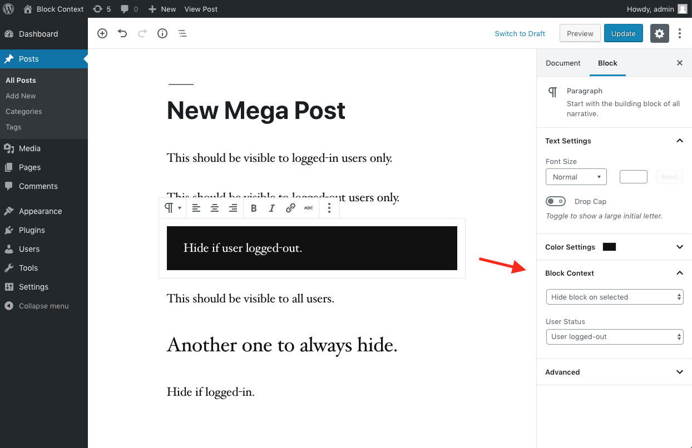

# Block Context for WordPress

**A WordPress plugin to show or hide WordPress editor (Gutenberg) blocks in context.**

Source of the [Gutenberg Block Context plugin](https://blockcontext.com) for WordPress.

## Requirements

- WordPress 5.0+ or the [Gutenberg Plugin](https://wordpress.org/plugins/gutenberg/).
- [Composer](https://getcomposer.org) and [Node.js](https://nodejs.org) for dependency management.
- [Docker](https://www.docker.com) for the local development environment.

## Install

- Search for "Block Context" under "Plugins → Add New" in your WordPress dashboard.

- Install as a [Composer](https://packagist.org/packages/preseto/block-context) dependency:

	  composer require preseto/block-context

## Feature Roadmap

See [the roadmap](https://github.com/preseto/block-context/projects/1).

## Development

1. Clone the plugin repository:

	   git clone https://github.com/preseto/block-context.git
	   cd block-context

2. Setup the development environment and tools using [Node.js](https://nodejs.org) and [Composer](https://getcomposer.org):

	   npm install
	   composer install

3. Start the local development environment (powered by [wp-env](https://developer.wordpress.org/block-editor/reference-guides/packages/packages-env/)):

	   npm run start

	which will be available at [http://localhost:8888](http://localhost:8888) (username: `admin`, password: `password`). WordPress core files are installed as the [`roots/wordpress`](https://roots.io/wordpress/) Composer dependency under `wordpress/`.

4. Build the plugin assets during development:

	   npm run dev

	or produce a production build:

	   npm run build

5. Lint and test the changes:

	   npm run lint
	   npm run test

## Screenshots

## Credits

Created by [Kaspars Dambis](https://kaspars.net).
